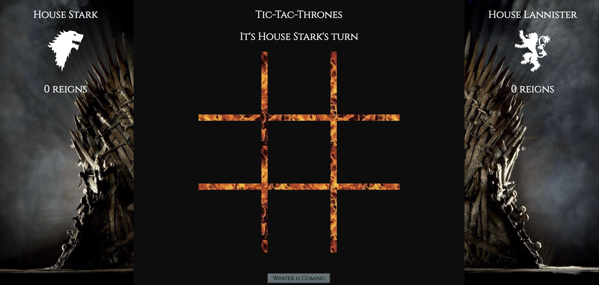

# tic-tac-toe
Final Mod 1 solo project

# Overview

The fate of Westeros is at stake as two opposing dynasties battle for the claim to the Iron Throne. Who will win?

This version of Tic-Tac-Toe was designed and built by Scott Gaines from a spec provided by the Turing School of Software and Design. It's architecture includes:
* README.md
* index.html
* styles.css
* main.js
* Game.js
* Player.js
* An assets directory containing all images

# Installation Steps

1. Fork and clone this repo to your local machine.
2. Run 'cd tic-tac-toe' to move into the root directory.
3. Run 'open index.html' to open the application in your browser.

# Using the App

1. With your arch nemesis, decide where your alliances lie and pick a player.
2. When it is your turn, click a tile on the grid to claim it for your House.
3. Claim three tiles in a row (vertical, horizontal, or diagonal) to stake your claim to the Iron Throne!
4. A draw will be declared if all nine tiles are selected without three in a row being claimed by a single house.
5. Ready to wipe the slate clean and start fresh? Click the "Winter is Coming" button.

# Developer Contact
Scott Gaines
+ scottdgaines@gmail.com
+ Slack: @Scott Gaines
+ LinkedIn: www.linkedin.com/in/scottdgainesfe

# Developer Notes

This project assignment included only the functionality and architecture requirements, leaving the theme and design up to the developer.

Updates I plan on implementing in the future include:
  * Toggling the grid background image between fire and ice after each round.
  * Displaying an image from the series in place of the grid whenever a round is won.
  * Giving users the option to select their player from a list of Westeros Houses before the game begins.
